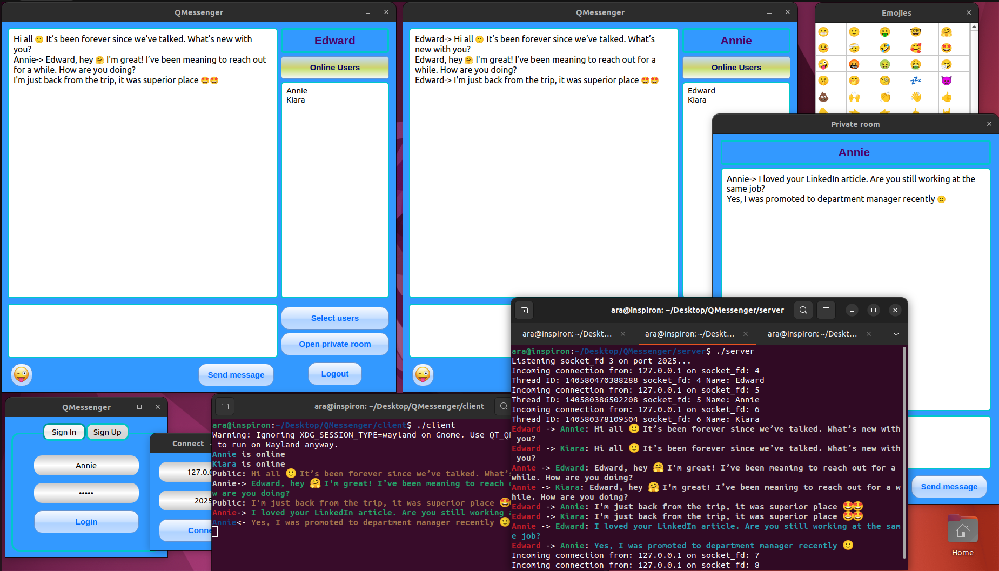

# QMessenger
Linux/Unix GUI messenger with Qt, POSIX sockets and threads

## Functional features
- private messaging
- group messaging (messages sent to multiple selected users)
- broadcast messaging (messages sent to all online users)
- supporting colored unicode emojies (UTF-16 encoding)
- messages visible in Linux terminal (colors and emojies also supported)
- login and registration (password is stored with sha254 hashing algorithm)
- easy upgradable to support file transfer
- easy upgradable to support SSL secure communication

## Files

```bash
.
├── client                             - Client side application directory
│   ├── client.cpp                     - 
│   ├── client.hpp                     - sockets, network part functionality of the messenger
│   ├── client.pro                     - 
│   ├── connect_login_register.cpp     - 
│   ├── connect_login_register.hpp     - connect, login and register windows
│   ├── encode_decode.cpp              - 
│   ├── encode_decode.hpp              - helper class for encoding/decoding messages
│   ├── icons                          - 
│   │   └── emoji_icon.png             - 
│   ├── main.cpp                       - main function
│   ├── messenger.cpp                  - 
│   ├── messenger.hpp                  - main window of the messenger, window dispatcher
│   ├── namespace_terminal.hpp         - helper class for formatting output in terminal
│   ├── private_window.cpp             - 
│   ├── private_window.hpp             - private message window
│   ├── resource.qrc                   - 
│   └── stylesheets                    - 
│       ├── emoji-data.txt             - 
│       ├── emoji_final.dat            - 
│       ├── mainwindow_stylesheet.qss  - 
│       └── stylesheet.qss             - 
├── README.md                          - 
└── server                             - Server side application directory
    ├── encode_decode.cpp              - 
    ├── encode_decode.hpp              - helper class for encoding/decoding messages
    ├── makefile                       - 
    ├── namespace_terminal.hpp         - helper class for formatting output in terminal
    ├── registered_users.db            - user information database file
    └── server.cpp                     - the server application
```

## Requirements
- g++ compiler with C++11 standart
- Supporting POSIX standarts
- GNU make
- OpenSSL version 1.1.1 or higher
- QMake version 3.1 or higher
- Qt version 5.9.5 or higher

## Compiling and usage:

on server side:

    $ sudo apt-get install libssl-dev
    $ openssl version
    $ make
    $ ./server
    
on client side:
   
    $ sudo apt-get install qt5-default
    $ qmake -v
    $ qmake
    $ make
    $ ./client

### Screenshot:


